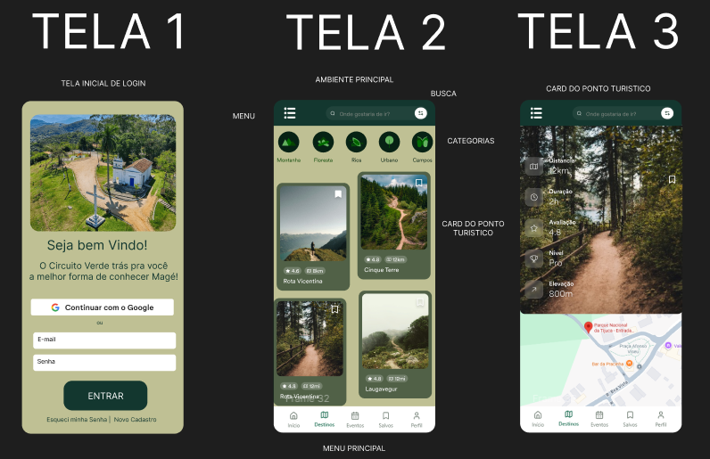

<p align="center"> MVP MOBILE </p>
  
## 🌱 Circuito Magé Verde

Plataforma digital que conecta visitantes, aventureiros e cidadãos aos principais pontos turísticos, trilhas, cachoeiras e eventos de Magé – RJ.
O projeto tem como objetivo fomentar o turismo sustentável, valorizar causas socioambientais e divulgar a cultura local.

---
## 👨‍💻 Equipe

* **Bruno Nunes** – Matrícula: 06007464
* **Murilo Torres** – Matrícula: 06007772
* **Thiago Andrade** – Matrícula: 06007617

---
## 📄 Licença

Este projeto é de caráter acadêmico e sem fins lucrativos.

---
## 📌 Objetivo

* Facilitar o acesso a informações sobre turismo e ecoturismo em Magé.
* Centralizar dados sobre **trilhas, cachoeiras e eventos** em um único sistema.
* Apoiar a gestão dos administradores com atualização rápida e confiável.
* Promover o engajamento turístico e socioambiental da cidade.

---
## 🗺️ Funcionalidades

* **Mapa interativo** dos pontos turísticos.
* **Agenda de eventos** culturais e ambientais.
* **Informações sobre trilhas** (rota, tempo, distância, nível de dificuldade).
* **Área administrativa** para atualização de conteúdos.
* Interface intuitiva e responsiva para facilitar a navegação.

---
## 👥 Público-Alvo

* Turistas e visitantes.
* Moradores da cidade.
* Aventureiros (trilheiros, ciclistas, exploradores).
* Todos que desejam conhecer e valorizar Magé.

---
## 🛠️ Tecnologias Utilizadas

- [Vite](https://vitejs.dev/) - Ferramenta de build e servidor de desenvolvimento com HMR rápido para o front-end.
- [Vue 3](https://vuejs.org/) - Framework progressivo JavaScript para construção da interface (SPA) com Composition API e Single File Components.
- [Vue Router](https://router.vuejs.org/) - Roteamento no cliente para navegação entre páginas (Início, Trilhas, Eventos, Salvos, Perfil, etc.).
- [JavaScript](https://developer.mozilla.org/pt-BR/docs/Web/JavaScript) - Linguagem base para a lógica do aplicativo.
- [HTML5 & CSS3](https://developer.mozilla.org/pt-BR/docs/Web/HTML) - Marcação e estilos da aplicação.

---
## 👨‍🏫 Instruções de Uso:

Certifique-se de ter o **Node.js** instalado no seu ambinte.
Clone este repositório:

 ```bash
 git clone https://github.com/thiagogigante/circuito-mage-verde-mvp.git
 ```
   
Entre no diretório do projeto

```powershell
cd circuito-mage-verde-mvp
```

Instale as dependências

```powershell
npm install
```

Inicie o servidor

```powershell
npm run dev
```

A aplicação estará disponível em: http://localhost:5173


### Build

```powershell
npm run build
npm run preview
```
---
## 💡 Prototipação

<p align="center">
  
</p>


